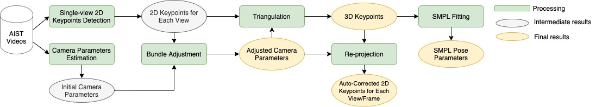

# AIST++ API
 
This repo contains starter code for using the AIST++ dataset. To download the
dataset or explore details of this dataset, please go to our dataset [website](https://google.github.io/aistplusplus_dataset).

## Installation
The code has been tested on `python>=3.7`. You can install the dependencies and this repo by:
``` bash
pip install -r requirements.txt
python setup.py install
```
You also need to make sure [ffmpeg](https://ffmpeg.org/download.html) is installed on your machine, if you would like to visualize the annotations using this api.

## How to use
We provide demo code for loading and visualizing AIST++ annotations. 
Note [AIST++ annotations and
videos](https://google.github.io/aistplusplus_dataset/download.html),
as well as the [SMPL model](https://smpl.is.tue.mpg.de/en) (for SMPL visualization only) are required to run the demo code.

The directory structure of the data is expected to be:
```
<ANNOTATIONS_DIR>
├── motions/
├── keypoints2d/
├── keypoints3d/
├── splits/
├── cameras/
└── ignore_list.txt

<VIDEO_DIR>
└── *.mp4

<SMPL_DIR>
├── SMPL_MALE.pkl
└── SMPL_FEMALE.pkl
```

#### Visualize 2D keypoints annotation
The command below will plot 2D keypoints onto the raw video and save it to the
directory `./visualization/`.
``` bash
python demos/run_vis.py \
  --anno_dir <ANNOTATIONS_DIR> \
  --video_dir <VIDEO_DIR> \
  --save_dir ./visualization/ \
  --video_name gWA_sFM_c01_d27_mWA2_ch21 \
  --mode 2D
```

#### Visualize 3D keypoints annotation
The command below will project 3D keypoints onto the raw video using camera parameters, and save it to the
directory `./visualization/`.
``` bash
python demos/run_vis.py \
  --anno_dir <ANNOTATIONS_DIR> \
  --video_dir <VIDEO_DIR> \
  --save_dir ./visualization/ \
  --video_name gWA_sFM_c01_d27_mWA2_ch21 \
  --mode 3D
```

#### Visualize the SMPL joints annotation
The command below will first calculate the SMPL joint locations from our motion
annotations (joint rotations and root trajectories), then project them onto the
raw video and plot. The result will be saved into the directory
`./visualization/`.
``` bash
python demos/run_vis.py \
  --anno_dir <ANNOTATIONS_DIR> \
  --video_dir <VIDEO_DIR> \ 
  --smpl_dir <SMPL_DIR> \
  --save_dir ./visualization/ \ 
  --video_name gWA_sFM_c01_d27_mWA2_ch21 \ 
  --mode SMPL
```

#### Visualize the SMPL Mesh
The command below will calculate the first frame SMPL mesh from our motion
annotations (joint rotations and root trajectories), and visualize in 3D. 
``` bash
# install some additional libraries for 3D mesh visualization
pip install vedo trimesh

python demos/run_vis.py \
  --anno_dir <ANNOTATIONS_DIR> \
  --smpl_dir <SMPL_DIR> \
  --video_name gWA_sFM_c01_d27_mWA2_ch21 \ 
  --mode SMPLMesh
```

#### Extract SMPL motion features
The command below will calculate and print two types of features for a motion sequence in SMPL format. We take reference from [fairmotion](https://github.com/facebookresearch/fairmotion/tree/master/fairmotion/tasks/clustering) to calculate the features.
``` bash
python demos/extract_motion_feats.py \
  --anno_dir <ANNOTATIONS_DIR> \
  --smpl_dir <SMPL_DIR> \
  --video_name gWA_sFM_c01_d27_mWA2_ch21
```

#### Multi-view 3D keypoints and motion reconstruction

This repo also provides code we used for constructing this dataset from the
multi-view [AIST Dance Video Database](https://aistdancedb.ongaaccel.jp/). The
construction pipeline starts with frame-by-frame 2D keypoint detection and
manual camera estimation. Then triangulation and bundle adjustment are applied to optimize the
camera parameters as well as the 3D keypoints. Finally we sequentially fit the SMPL model to 3D keypoints to get a motion sequence represented using joint angles and a root trajectory. The following figure shows our pipeline overview.

<div align="center">

<p> AIST++ construction pipeline overview.</p>
</div>

The annotations in AIST++ are in [COCO-format](https://cocodataset.org/#home) for 2D \& 3D keypoints, and
[SMPL-format](https://smpl.is.tue.mpg.de/) for human motion annotations. It is designed to serve general
research purposes. However, in some cases you might need the data in different format
(e.g., [Openpose](https://github.com/CMU-Perceptual-Computing-Lab/openpose) / 
[Alphapose](https://github.com/MVIG-SJTU/AlphaPose) keypoints format, or [STAR](https://star.is.tue.mpg.de/) human motion
format). **With the code we provide, it should be easy to construct your own
version of AIST++, with your own keypoint detector or human model definition.**

**Step 1.** Assume you have your own 2D keypoint detection results stored in `<KEYPOINTS_DIR>`, you can start by preprocessing the keypoints into the `.pkl` format that we support. The code we used at this step is as follows but you might need to modify the script `run_preprocessing.py` in order to be compatible with your own data.
``` bash
python processing/run_preprocessing.py \
  --keypoints_dir <KEYPOINTS_DIR> \
  --save_dir <ANNOTATIONS_DIR>/keypoints2d/
```

**Step 2.** Then you can estimate the camera parameters using your 2D keypoints. This step
is optional as you can still use our camera parameter estimates which are
quite accurate. At this step, you will need the `<ANNOTATIONS_DIR>/cameras/mapping.txt` file which stores the mapping from videos to different environment settings.
``` bash
# install some additional libraries
pip install -r processing/requirements.txt

# If you would like to estimate your own camera parameters:
python processing/run_estimate_camera.py \
  --anno_dir <ANNOTATIONS_DIR> \
  --save_dir <ANNOTATIONS_DIR>/cameras/
# Or you can skip this step by just using our camera parameter estimates.
```

**Step 3.** Next step is to perform 3D keypoints reconstruction from multi-view 2D keypoints
and camera parameters. You can just run:
``` bash
python processing/run_estimate_keypoints.py \
  --anno_dir <ANNOTATIONS_DIR> \
  --save_dir <ANNOTATIONS_DIR>/keypoints3d/
```

**Step 4.** Finally we can estimate SMPL-format human motion data by fitting
the 3D keypoints to the SMPL model. If you would like to use another human model such
as [STAR](https://star.is.tue.mpg.de/), you will need to do some modifications in the script
`run_estimate_smpl.py`. The following command runs SMPL fitting.
``` bash
python processing/run_estimate_smpl.py \
  --anno_dir <ANNOTATIONS_DIR> \
  --smpl_dir <SMPL_DIR> \
  --save_dir <ANNOTATIONS_DIR>/motions/
```
Note that this step will take several days to process the entire dataset if your machine has only one GPU.
In practise, we run this step on a cluster, but are only able to provide the single-threaded version.

#### MISC.
- COCO-format keypoint definition:
```
[
"nose", 
"left_eye", "right_eye", "left_ear", "right_ear", "left_shoulder","right_shoulder", 
"left_elbow", "right_elbow", "left_wrist", "right_wrist", "left_hip", "right_hip", 
"left_knee", "right_knee", "left_ankle", "right_ankle"
]
```

- SMPL-format body joint definition:
```
[
"root",     
"lhip", "rhip", "belly",    
"lknee", "rknee", "spine",    
"lankle", "rankle", "chest",     
"ltoes", "rtoes", "neck", 
"linshoulder", "rinshoulder",     
"head",  "lshoulder", "rshoulder",      
"lelbow", "relbow",      
"lwrist", "rwrist",     
"lhand", "rhand",
]
```
